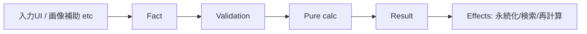

# 関数型ドメインモデリングで麻雀の点数計算アプリを作ってみた

会社で**関数型ドメインモデリング**の勉強会に参加し、「Pure な計算と Effects（副作用）を分離する」「入力を観測された事実（Fact）に正規化してから計算に回す」といった考え方に触れました。学んだことを何か形にしたくて、題材に選んだのが**麻雀の点数計算**です。年末やお盆の帰省で打つ機会が多く、ルールと境界条件がそこそこ複雑なので、ドメインモデリングの練習に向いていると思いました。

---

## 関数型ドメインモデリングで何を目指したか

関数型ドメインモデリングでは、**「計算」と「外界とやりとりする部分」をはっきり分ける**ことがよく言われます。このプロジェクトでは、正確な点数計算を担保しつつ、**入力経路（手入力や、将来の画像補助）と計算ロジックとを完全に分離**することを狙いました。入力がどこから来ようと、いったん **Fact（観測された事実）** に落とし込めば、その先の計算は Pure に閉じます。そうすれば、あとから「写真から牌を読み取って入力する」といった機能を足しても、計算の核はそのままで済みます。履歴を Fact と結果のペアで蓄積しておけば、符計算の補助や AI コメントといった拡張にもつなげやすくなります。

そのために、**Fact → Validation → Pure（計算）→ Effects（永続化）** という流れでドメインを分けています。入力が「手入力」か「画像補助」かは Fact の手前の話で、**計算ロジックは Fact 以降にしか依存しない**、という境界を守る形です。

---

## 設計のイメージ：Fact / Validation / Pure / Effects

関数型ドメインモデリングでは、**Pure（副作用のない計算）と Effects（DB アクセス・I/O など）を分離する**のが柱の一つです。このプロジェクトでは、その境界を「Fact → Validation → Pure → Effects」という 4 段階で置いています。全体の流れは以下のとおりです。

- **Fact** … 親/子、ツモ/ロン、翻・符、本場・供託、放銃者といった「観測された事実」だけを表す型です。手入力でも画像補助でも、**入力経路に依存しない形に正規化する**のが関数型ドメインモデリングのよくあるやり方で、ここでその境界を設けています。
- **Validation** … 符の取り得る値、ツモのときは放銃者なし、ロンのときは放銃者必須、といった整合性チェックです。**不正な Fact を Pure に渡さない**ための関所で、`ValidatedFact` を得たあとだけ計算に進めます。
- **Pure** … 副作用のない計算です。`Score = f(ValidatedFact, RuleSet)` という形で、**同じ入力からは必ず同じ結果**になります。Pure に閉じているおかげで、単体テストがしやすく、ロジックを差し替えたときも**過去の Fact に対して再計算**すれば差分を確認できます。
- **Effects** … DB への保存・取得、将来的には添付のアップロードなど、**外界とやりとりする部分**です。Pure の外に押し出すことで、計算ロジックは「いつ」「どこに」保存するかを知らずに済みます。

今回は**役判定と符計算はやりません**。翻・符はユーザーが入力し、計算ロジックは Pure に閉じる、という割り切りにしています。

---

## 作ったもの

**できること**

手入力で親/子・ツモ/ロン・翻・符・本場・供託・放銃者を入れると、打点と点数移動（誰が誰にいくら払うか）を計算します。計算結果は保存でき、履歴一覧・詳細の参照、メモ・タグでの検索ができます。Fact と結果のペアで保存しているので、**計算ロジックを Pure に閉じた恩恵**として、`calc_version` と `rule_set_id` を記録し、将来ロジックを変えたときに**過去の Fact へ再計算をかけ、差分を確認**できるようにしてあります。

**できないこと**

役判定（翻の自動算出）、符計算（面子・待ち形からの符内訳）、ローカル役・罰符・責任払いなどです。

**技術スタック**

これまであまり触ってこなかった技術を中心に選びました。Frontend は Next.js、Backend は Rust（axum / sqlx）、DB・Auth・Storage の想定は Supabase です。ローカルでは SQLite でそのまま動かせます。

## 麻雀ルールについて

卓によってルールが揺れるので、このプロジェクトでは次のように固定しています。

- **対象** … 4人麻雀、赤あり
- **本場** … 1本場 = +300点（ツモなら各家 +100、ロンなら放銃者のみ +300）
- **供託** … 1本 = +1000点（アガり者が総取り）
- **打点上限** … 切り上げ満貫なし、数え役満なし（13翻以上は三倍満止まり）、ダブル役満なし

---

## 構成とこれから

関数型ドメインモデリングの「Pure と Effects の分離」に沿って、バックエンドを次のように分けています。

- `frontend/` … Next.js（`/calc` が入力、`/history` が一覧・詳細）です。ルートは `/calc` にリダイレクトします。
- `backend/mj-domain/` … **Fact の型定義、Validation、Pure 計算**です。DB や HTTP に依存せず、`ValidatedFact` と `RuleSet` から `CalcResult` を返すだけのクレートにしています。
- `backend/mj-api/` … **Effects の境界**です。HTTP を受け、Validation → Pure を呼び出し、その結果を DB に保存する責務を持ちます。
- `supabase/migrations/` … Supabase（Postgres）向けのスキーマ案です。`hands` の RLS など、`calc_version`・`rule_set_id`・`fact_json` を軸にし、**Fact と結果を永続化する**形にしています。

今後は、符計算補助（面子・待ち形から符を算出）、写真入力の補助、履歴への AI コメントなどもスコープに入れたいと思っています。いずれも「入力が Fact に正規化される」前提であれば、既存の Pure 計算とは切り分けたまま拡張できる想定です。

